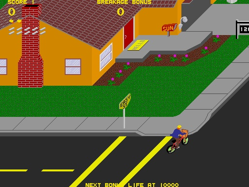

# A Cabalo da Navalla

## Visión Xeral

**Título Provisional:** A Cabalo da Navalla

**Elevator Pitch:**
Unha adaptación moderna do clásico Paperboy. O xogador é un yonqui e mariscador furtivo que, montado nun patinete eléctrico, se adica a vender ameixas e outros froitos do mar polas casas e restaurantes mentres esquiva diferentes obstáculos. O xogo combina acción, negociación e exploración.

**Xénero:** Arcade, Acción, Estratexia

**Plataforma:** PC

## Concepto

### Mecánicas Principais

- **Fase 1 - Reparto en Patinete:** (Vista isométrica)
  - O xogador percorre as rúas nun patinete eléctrico, lanzando “avisos” ás portas das casas. Debe esquivar coches de policía e recoller cabichas que outorgan poderes especiais. Pódense atopar camiños secretos que levan a encontros inesperados.

- **Fase 2 - Negociación:** (Vista estática)
  - Cando o xogador acerta na entrega dun aviso e unha señora ou hostaleiro abre a porta, actívase unha fase de negociación. Aquí, o xogador debe convencer ao seu interlocutor de mercar ameixas, utilizando unha mecánica de decisións e diálogos enxeñosos.

- **Fase 3 - Recollida de Ameixas:** (3D)
  - Nesta fase, o xogador mergúllase nun entorno 3D onde busca ameixas na area da praia. Debe evitar aos vixiantes da cofradía mentres recolle suficientes ameixas para vender na seguinte etapa.

### Estilo Visual

- Perspectiva isométrica, 3D

### Referencias Artísticas

- Paperboy Atari games, 1984

## Mercado Objetivo

**Público al que Está Dirigido:**

- Xogadores adultos de 18-45 anos
- Aficionados aos xogos arcade retro e á súa reinterpretación moderna
- Xogadores que aprecian o humor negro e a sátira social
- Público que busca experiencias de xogo únicas e con identidade local galega
- Xogadores casuais que gozan de sesións curtas pero intensas

**Tendencias del Mercado:**

- Crecente interese polos xogos indie que mesturan mecánicas clásicas con temas contemporáneos
- Valoración das experiencias de xogo con forte identidade cultural e local
- Demanda de xogos que combinen humor e crítica social
- Éxito dos xogos con múltiples capas de xogabilidade (acción, negociación, sigilo)

## Equipo y Capacidades

**Presentación del Equipo:**

- **Director Creativo e Deseñador do Xogo:** Diego Santiago Lijó
- **Programador/a Principal:** Diego Vieiros Pérez

**Capacidades:**

- Experiencia en desenvolvemento de apps
- Coñecemento profundo da cultura e contexto galego
- Habilidades en deseño de interfaces e experiencia de usuario

## Plan de Desarrollo

**Cronograma Estimado de Desarrollo:**

- Semana 1: Prototipado das mecánicas principais do patinete e obstáculos
- Semana 2-3: Desenvolvemento básico das tres fases de xogo
- Semana 4: Sistema de diálogos e lóxica de negociación simple
- Semana 5-6: Arte básica e sons
- Semana 7: Integración de sistemas e testing
- Semana 8: Pulido final e preparación para lanzamento

**Presupuesto Inicial Requerido:**

- Arte básica e assets: 30€
- Sons e música libre de dereitos: 20€
- Software e ferramentas: 30€
- Marketing básico (redes sociais): 10€
- Imprevistos: 10€
- **Total estimado:** 100€

## Hook Único

**Diferenciador del Juego:**

- Mestura innovadora de mecánicas clásicas con temática contemporánea local
- Narrativa que aborda temas sociais con humor negro
- Tres fases de xogo distintivas que se complementan
- Forte identidade cultural galega con potencial de conexión universal
- Sistema de negociación único baseado en diálogos enxeñosos

## Material Visual

Concept art, prototipos, diagramas
Deseños preliminares do protagonista e o seu patinete
Mockups das diferentes vistas de xogo (isométrica, negociación e 3D)
Esquemas de interface de usuario
Concept art dos escenarios principais
Storyboards das secuencias de xogo clave

## Conclusión

**Resumen Final:**
"A cabalo da navalla" é unha proposta única que combina a nostalxia dos xogos arcade coa realidade social contemporánea. A súa mestura de humor, acción e estratexia, xunto coa súa forte identidade cultural, créanlle un oco propio no mercado. O xogo non só entretén, senón que tamén reflexiona sobre a sociedade actual dunha forma única e memorable.

## Contacto

**Información de Contacto:**

- Diego Vieiros Pérez
- Diego Santiago Lijó